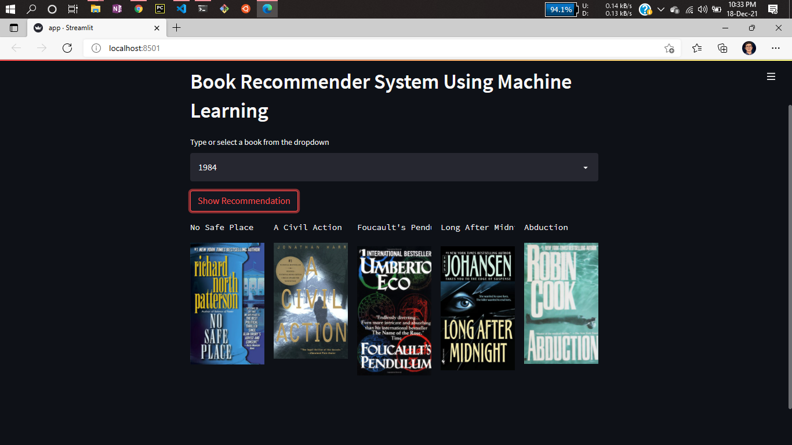
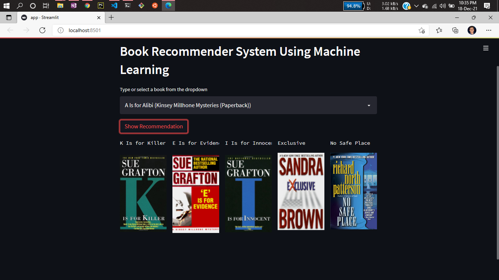

# Project: Book Recommender System Using Machine Learning! | Collaborative Filtering Based


Welcome to the Book Recommendation System repository! This project implements a collaborative filtering-based recommendation system that suggests books to users based on their reading preferences.


# Types of Recommendation System :

### 1 ) Content Based :

- Content-based systems, which use characteristic information and takes item attriubutes into consideration .

- Twitter , Youtube .

- Which music you are listening , what singer are you watching . Form embeddings for the features .
	
- User specific actions or similar items reccomendation .
	
- It will create a vector of it .
	
- These systems make recommendations using a user's item and profile features. They hypothesize that if a user was interested in an item in the past, they will once again be interested in it in the future
	
- One issue that arises is making obvious recommendations because of excessive specialization (user A is only interested in categories B, C, and D, and the system is not able to recommend items outside those categories, even though they could be interesting to them).

### 2 ) Collaborative Based :
		
- Collaborative filtering systems, which are based on user-item interactions.
	
- Clusters of users with same ratings , similar users .
	
- Book recommendation , so use cluster mechanism .
	
- We take only one parameter , ratings or comments .
	
- In short, collaborative filtering systems are based on the assumption that if a user likes item A and another user likes the same item A as well as another item, item B, the first user could also be interested in the second item . 
	
- Issues are :

	- User-Item nXn matrix , so computationally expensive .

	- Only famous items will get reccomended .

	- New items might not get reccomended at all .   

### 3 ) Hybrid Based :
	
- Hybrid systems, which combine both types of information with the aim of avoiding problems that are generated when working with just one kind.

- Combination of both and used now a days .

- Uses : word2vec , embedding .           

# About this project:

This is a streamlit web application that can recommend various kinds of similar books based on an user interest.
here is a demo,


# Demo:






# Dataset has been used:

* [Dataset link](https://www.kaggle.com/ra4u12/bookrecommendation)

# Concept used to build the model.pkl file : NearestNeighbors

1 . Load the data
	
2 . Initialise the value of k

3 . For getting the predicted class, iterate from 1 to total number of training data points

4 . Calculate the distance between test data and each row of training data. Here we will use Euclidean distance as our distance metric since it’s the most popular method. 

5 . Sort the calculated distances in ascending order based on distance values
	
6 . Get top k rows from the sorted array

# How to run?
### STEPS:

Clone the repository

```bash
https://github.com/mkothm/book-recommender
```
### STEP 01- Create a conda environment after opening the repository

```bash
conda create -n books python=3.7.10 -y
```

```bash
conda activate books
```


### STEP 02- install the requirements
```bash
pip install -r requirements.txt
```


```bash
#run this file to generate the models

Books Recommender.ipynb
```

Now run,
```bash
streamlit run app.py
```


```bash
Author: Mkothm
Email: mkothman.jr@gmail.com

```


